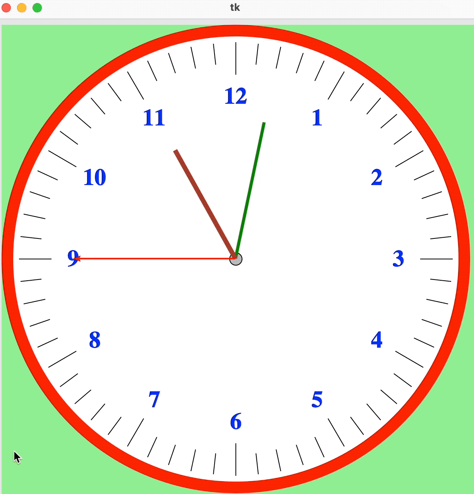
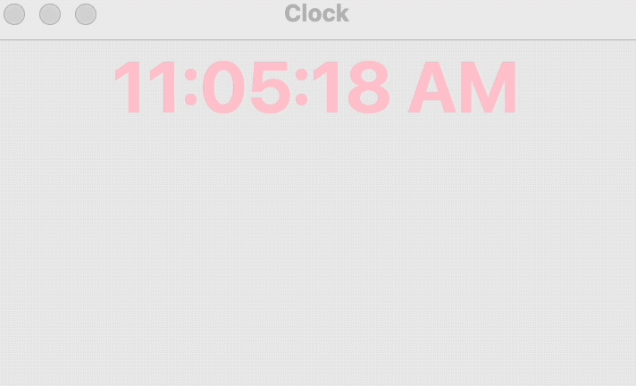
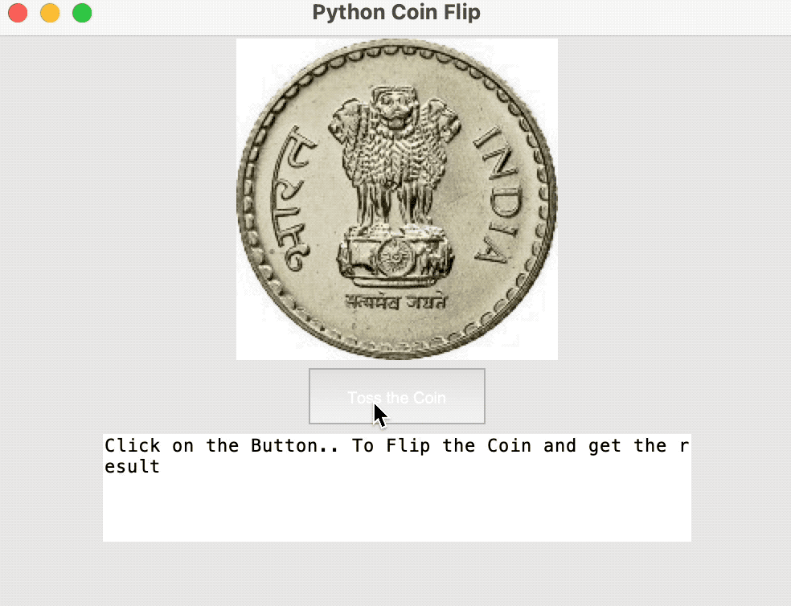
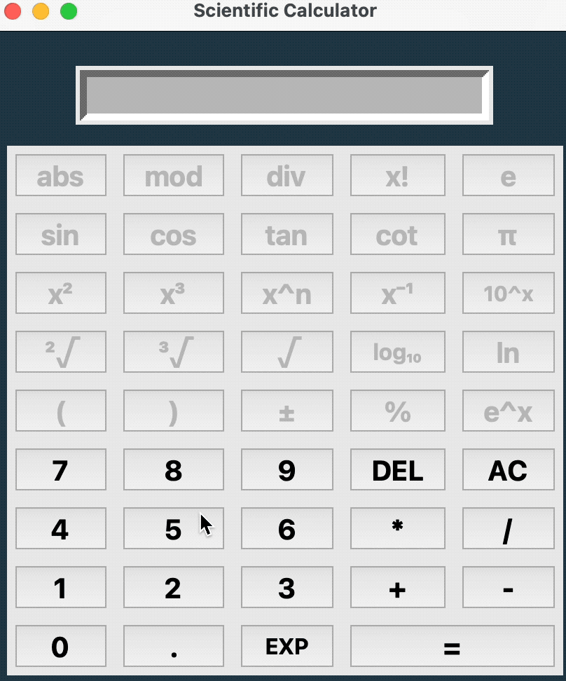

# Tkinter GUI examples

This is just a brief collection of some Tkinter GUI examples.

## Installation and usage

1. cd to the downloaded and extracted repo folder.
2. Create a virtual environment and install the requirements:
    * with conda:
        ```terminal
        conda create -n Tkinter_tests -y python=3.9 pip
        conda activate Tkinter_tests
        pip install -r requirements.txt
        ```
    * with pip:
        ```terminal
        python -m venv Tkinter_test
        source Tkinter_test/bin/activate
        pip install -r requirements.txt
        ```

To run one of the scripts, simply execute:

```terminal
python analog_clock.py
```




```terminal
python digital_clock.py
```




```terminal
python coin_flip.py
```




```terminal
python calculator.py
```




## Sources

* Analog Clock: <https://www.plus2net.com/python/tkinter-analog-clock-dial.php>
* Digital Clock: <https://github.com/Aditya-Bhate/Digital-Clock-using-Python-Tkinter>
* Calculator: <https://github.com/kostasthanos/Tkinter-Calculator>
* Coin Flip: <https://www.askpython.com/python-modules/tkinter/coin-flip-gui>
